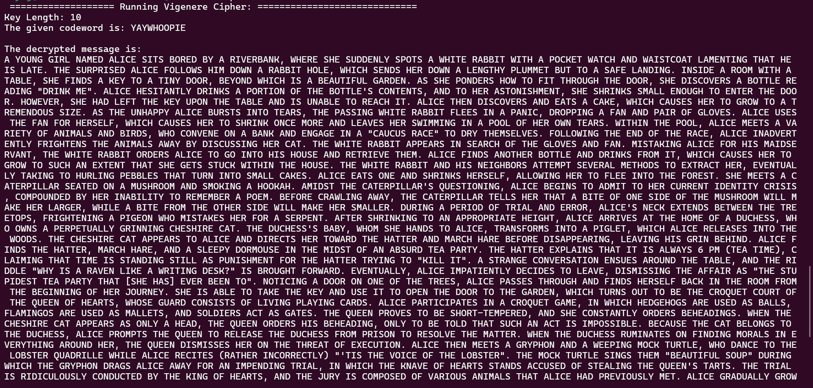

# Vigenere-Cipher-Decrypter
A decrypter for a file encrypted with the Vigenere cipher.

## Vigenere Cipher
The Vigenere Cipher is a polyalphabetic substitution cipher wherein each letter of the text is encrypted with a different Caesar cipher, whose increment is determined by the corresponding letter of the keyword. The method is more secure than the Caesar cipher due to the introduction of multiple shifts brought upon by a single keyword.

## Methodology
To break the encryption provided in the text, we use Kasiski's method, which relies on analysing repeated substrings in the given text and measure the distances between these occurrences. The key length is most likely a common factor of these distances, which helps us determine the key length in order to aid the decryption process. We then use the index of coincidence, which compares the frequency of occurrence of characters in the text to a table with the expected frequencies of characters in the English alphabet. Through this method, we can estimate the likelihood of a text being encrypted with a word of a specific key length in order to determine the keyword by mapping these character frequencies.

## Steps to use the Vigenere Decrypter
To use the decrypter, upload the text to be decrypted as a .txt file (for example: ciphertext.txt) file in the same directory as the vigenere-decrypter.c file.

Run the following code block in the terminal:
````
gcc vigenere-decrypter.c
./a.out filename.txt
````

## Test Execution
````
gcc vigenere-decrypter.c
./a.out ciphertext.txt
````


## Sources of Reference
- [Vigenere cipher - Wikipedia](https://en.wikipedia.org/wiki/Vigen%C3%A8re_cipher)
- [Kasiski's Method (Dr. Ching-Kuang Shene, Michigan Technological University)](https://pages.mtu.edu/~shene/NSF-4/Tutorial/VIG/Vig-Kasiski.html)
- [Index of Coincidence (Dr. Ching-Kuang Shene, Michigan Technological University)](https://pages.mtu.edu/~shene/NSF-4/Tutorial/VIG/Vig-IOC.html)
